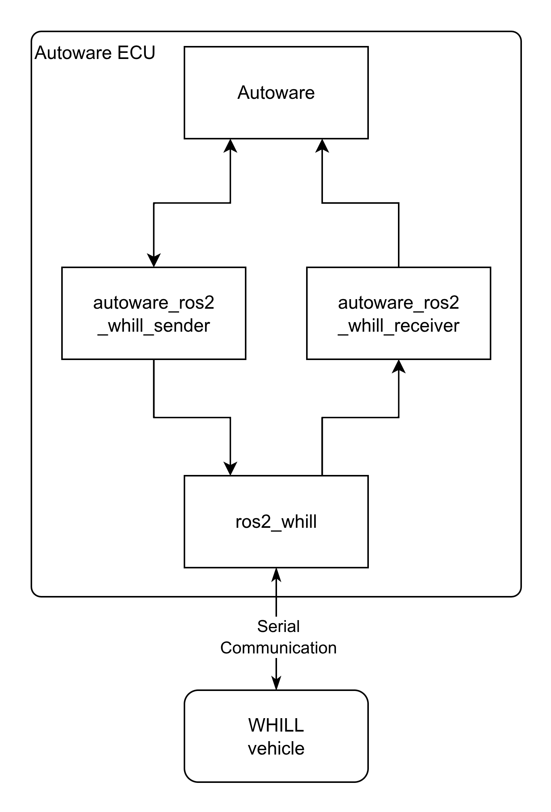

# autoware_ros2_whill_adapter

This is an adapter package that connects Autoware and [ros2_whill](https://github.com/whill-labs/ros2_whill).

# Overview

# Inputs / Outputs

## autoware_ros2_whill_sender

### Input

| Name | Type | Description |
| - | - | - |
| /control/command/control_cmd | autoware_control_msgs::msg::Control | lateral and longitudinal control command |
| /control/command/gear_cmd | autoware_vehicle_msgs::msg::GearCommand | gear command |
| /control/command/emergency_cmd | tier4_vehicle_msgs::msg::VehicleEmergencyStamped | emergency command |

### Output

| Name | Type | Description |
| - | - | - |
| /vehicle/status/gear_status | autoware_vehicle_msgs::msg::GearReport | gear status |
| /whill/controller/cmd_vel | geometry_msgs::msg::Twist | twist command converted from autoware control command|

### Service

| Name | Type | Description |
| - | - | - |
| /whill/set_speed_profile_srv | whill_msgs::srv::SetSpeedProfile | This feature is not yet implemented. |

### Parameters

| Name | Type | Description | Default value |
| - | - | - | - |
| control_cmd_timeout_sec_ | double | The timueout threshold for the control command. If a timeout occurs, the vehicle speed will be set to zero.| 0.5 [s] |
| loop_rate_ | double | The cycle for sending twist commands to the vehicle | 50.0 [hz] |
| vehicle_velocity_limit_ | double | This value will cap the velocity sent to the vehicle. | 1.67 [m/s] (≒ 6.0 [km/h]) |

## autoware_ros2_whill_receiver

### Input

| Name | Type | Description |
| - | - | - |
| /whill/states/model_cr2 | whill_msgs::msg::ModelCr2State | status message from the WHILL vehicle |

### Output

| Name | Type | Description |
| - | - | - |
| /vehicle/status/velocity_status | autoware_vehicle_msgs::msg::VelocityReport | current velocity status |
| /vehicle/status/steering_status | autoware_vehicle_msgs::msg::SteeringReport | current steering wheel angle status |
| /vehicle/status/turn_indicators_status | autoware_vehicle_msgs::msg::TurnIndicatorsReport | current turn indicators status |
| /vehicle/status/hazard_lights_status | autoware_vehicle_msgs::msg::HazardLightsReport | current hazard lights status |
| /vehicle/status/control_mode | autoware_vehicle_msgs::msg::ControlModeReport | current control mode status |
| /vehicle/status/velocity_kmph | tier4_debug_msgs::msg::Float32Stamped | current velocity in km/h |
| /vehicle/status/steering_wheel_deg | tier4_debug_msgs::msg::Float32Stamped | current steering wheel angle in degree |
| /diagnostics | diagnostic_msgs::msg::DiagnosticArray | diagnostics |
